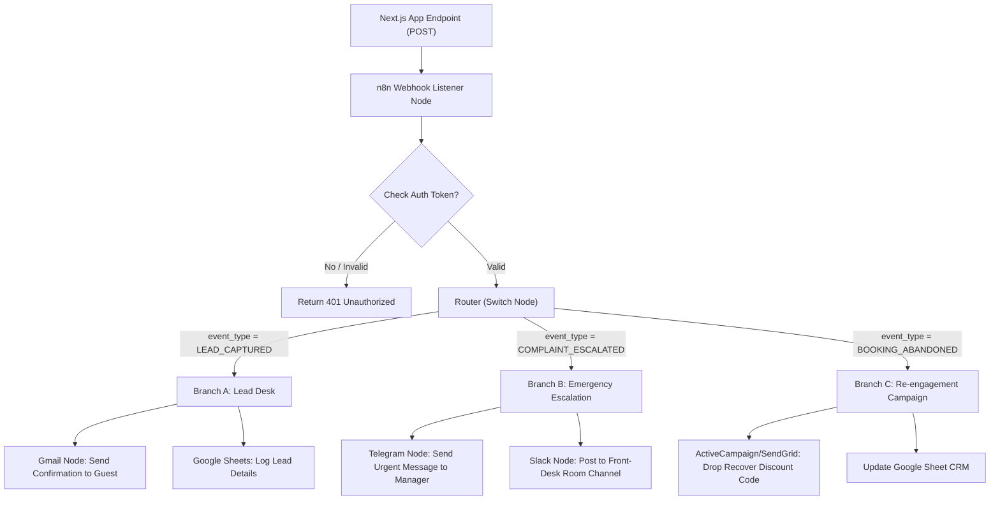

# Elara AI Chatbot - n8n Workflow Automation Guide

This guide outlines how to configure **n8n** (a self-hosted or cloud automation platform) to receive webhooks from the Elara chatbot, route them based on event types, and execute notifications, database entries, and email campaigns.

---

## 📐 Automation Architecture

The chatbot dispatches three event types to the unified `N8N_WEBHOOK_URL` defined in your `.env` file:
1. `LEAD_CAPTURED` (Branch A): Fired when a guest completes a conversational booking query.
2. `COMPLAINT_ESCALATED` (Branch B): Fired when a guest reports an active room or service issue.
3. `BOOKING_ABANDONED` (Branch C): Fired via a passive cron scan if a guest starts a booking conversation, enters their email, but goes idle for 30+ minutes.

### Mermaid Workflow Flowchart



---

## 📨 Webhook Specifications & Payloads

The webhook is a `POST` request sent with a custom header `x-elara-secret` containing your `JWT_SECRET` for secure communication.

### 1. Lead Captured Payload
* **Trigger:** Guest finishes providing contact and check-in details.
* **Payload JSON:**
```json
{
  "event_type": "LEAD_CAPTURED",
  "session_id": "session_8j3kd9sk",
  "timestamp": "2026-05-22T07:40:00Z",
  "guest": {
    "name": "Sarah",
    "email": "sarah@email.com",
    "phone": "704-555-0199",
    "checkin_date": "June 10, 2026",
    "room_preference": "1 King Bed, Nonsmoking"
  }
}
```

### 2. Complaint Escalated Payload
* **Trigger:** Active guest complains about in-stay parameters (e.g., "elevator not working" or "noise on 2nd floor").
* **Payload JSON:**
```json
{
  "event_type": "COMPLAINT_ESCALATED",
  "session_id": "session_92kd7sj",
  "timestamp": "2026-05-23T13:30:00Z",
  "guest": {
    "name": "John Doe",
    "room": "204",
    "contact": "+1 (704) 555-0199"
  },
  "complaint_summary": "Noise complaint from room 204",
  "complaint_details": "There is a very loud humming noise coming from the AC unit in room 204. It makes it impossible to sleep."
}
```

### 3. Booking Abandoned Payload
* **Trigger:** Guest entered their email address but stopped responding before submitting the final room inquiry form.
* **Payload JSON:**
```json
{
  "event_type": "BOOKING_ABANDONED",
  "session_id": "session_83kd9s",
  "timestamp": "2026-05-22T08:12:00Z",
  "guest": {
    "name": "John",
    "email": "john@email.com",
    "phone": "Not provided",
    "checkin_date": "Not selected",
    "room_preference": "King"
  }
}
```

---

## 🛠️ n8n Node Configuration Steps

### Step 1: Webhook Trigger Node
1. Add a **Webhook** node to a new n8n canvas.
2. Set **HTTP Method** to `POST`.
3. Set **Path** to `elara-events`.
4. Set **Respond** to `Using 'Respond to Webhook' Node` (in older n8n versions, this is **Response Mode** set to `When Last Node Finishes`). *Note: Do not leave this on "Immediately", otherwise n8n will return 200 OK automatically before executing the authentication header check!*
5. Copy the Test URL (e.g., `http://your-n8n-domain/webhook-test/elara-events`).

### Step 2: Validate Authentication (Header Check) & Status Response
To ensure only Elara can trigger this workflow:
1. Add an **If** node.
2. Check if the header `x-elara-secret` matches the value of your `JWT_SECRET` in `.env`.
   - **Value 1:** `{{ $headers["x-elara-secret"] }}`
   - **Operation:** `Equal`
   - **Value 2:** `comfort-inn-shelby-elara-token-secret-123` (or your current JWT_SECRET key)
3. **Configure the False Branch (Auth Failure):**
   - Connect the `false` output of the If node to a **Respond to Webhook** node.
   - Set **Response Code** to `401`.
   - Set **Response Body** to `Custom` and choose `JSON`. Enter:
     ```json
     { "success": false, "error": "Unauthorized: Invalid secret token" }
     ```
4. **Configure the True Branch (Auth Success & Immediate Response):**
   - Connect the `true` output of the If node to another **Respond to Webhook** node.
   - Set **Response Code** to `200`.
   - Set **Response Body** to `Custom` and choose `JSON`. Enter:
     ```json
     { "success": true, "message": "Event queued successfully" }
     ```
   - Connect the output of this success response node to the **Router/Switch Node** (Step 3). This is a best-practice n8n pattern: Next.js gets an immediate `200 OK` success reply, while the rest of the flow (Telegram, Slack, Email) runs asynchronously in the background.

### Step 3: Router Node (Switch)
1. Add a **Switch** node.
2. Set **Data Type** to `String`.
3. Set **Property Name** to `{{ $json.event_type }}`.
4. Define three routing rules:
   - Rule 1: String equals `LEAD_CAPTURED` -> route to **Branch A**
   - Rule 2: String equals `COMPLAINT_ESCALATED` -> route to **Branch B**
   - Rule 3: String equals `BOOKING_ABANDONED` -> route to **Branch C**

---

## 🌿 Branch Implementations

### Branch A: Lead captured processing (Gmail + Google Sheets)
1. **Google Sheets Node (Append):**
   - Connect your Google Account.
   - Choose a spreadsheet named `Comfort Inn Shelby Leads`.
   - Map columns: `Name` to `{{ $json.guest.name }}`, `Email` to `{{ $json.guest.email }}`, `Phone` to `{{ $json.guest.phone }}`, `Check-in` to `{{ $json.guest.checkin_date }}`, `Room` to `{{ $json.guest.room_preference }}`, and `Date` to `{{ $json.timestamp }}`.
   *(Note: CRS sync is currently disabled and all reservations are managed via the Google Sheet and manual front desk follow-ups).*
2. **OpenAI Node (Draft Warm Email):**
   - **Action:** Generate text or run an AI Agent.
   - **Prompt:**
     ```text
     You are Elara, the warm and welcoming AI virtual concierge at Comfort Inn Shelby.
     Write a personalized, friendly email to a guest who has just submitted a booking/rate inquiry (note: this is NOT a completed reservation confirmation).
     
     Guest Details:
     - Name: {{ $json.guest.name }}
     - Check-in Date: {{ $json.guest.checkin_date }}
     - Room Preference: {{ $json.guest.room_preference }}
     
     Guidelines:
     - Infuse the text with genuine Southern hospitality.
     - Clarify that we have received their inquiry preferences and our front desk will follow up shortly at {{ $json.guest.phone }} to finalize their booking.
     - Provide the option to book directly online right now to instantly lock in their rate: https://www.comfortshelby.com/click-reservation
     - Proactively mention that our outdoor pool and elevator are currently closed for renovations, but first-floor ground rooms are fully accessible.
     - Output the response as a clean HTML email body (use paragraphs, strong tags, and lists). Do NOT wrap in <html> or <body> tags.
     ```
3. **Gmail / SendGrid Node (Send Confirmation):**
   - **To Email:** `{{ $json.guest.email }}`
   - **Subject:** `Comfort Inn Shelby - Rate Inquiry Received 🍳`
   - **Body (HTML):** Select expression and map it to the output of the OpenAI node (e.g., `{{ $json.text }}` or `{{ $json.message.content }}`).

### Branch B: Urgent Complaint Escalation (Telegram Bot + Slack)
1. **Telegram Node (Send Message to Manager Chat/Group):**
   - Add a **Telegram** node in n8n.
   - Select **Connection** and authenticate using your Telegram Bot Token. 
     *(To get a token, message `@BotFather` on Telegram, create a new bot, and copy the HTTP API token).*
   - Set **Chat ID** to the General Manager's Telegram Chat ID or the Front Desk group chat ID. 
     *(To find your Chat ID, message `@userinfobot` or add your bot to the group and fetch updates from `https://api.telegram.org/bot<TOKEN>/getUpdates`).*
   - Set **Text** to:
     ```text
     ⚠️ [URGENT ELARA COMPLAINT]
     
     Guest has reported an active room/service issue:
     • Guest Name: {{ $json.guest.name || 'Not provided' }}
     • Room Number: Room {{ $json.guest.room || 'N/A' }}
     • Contact: {{ $json.guest.contact || 'Not provided' }}
     • Summary: {{ $json.complaint_summary }}
     • Full Details: {{ $json.complaint_details }}
     • Session ID: {{ $json.session_id }}
     
     👉 Open console to view full transcript: http://localhost:3000/elara-admin
     ```
2. **Slack / Microsoft Teams Node (Front-Desk Channel Notification):**
   - Channel: `#front-desk-alerts`
   - **Message Text:**
     ```text
     🚨 *Urgent Escalation from Elara Concierge:*
     *Guest:* {{ $json.guest.name || 'Not provided' }} (Room {{ $json.guest.room || 'N/A' }})
     *Contact:* {{ $json.guest.contact || 'Not provided' }}
     *Issue:* {{ $json.complaint_summary }}
     *Details:* {{ $json.complaint_details }}
     *Session ID:* `{{ $json.session_id }}`
     Please log in to the <http://localhost:3000/elara-admin|Admin Console> to view the full transcript and contact the guest.
     ```

### Branch C: Booking Abandonment Re-engagement (Email Drop)
1. **Wait / Delay Node (Optional):**
   - Set delay to `2 hours` (or let n8n send immediately if Next.js already handles the 30-minute delay).
2. **OpenAI Node (Draft Personalized Recovery Email):**
   - **Action:** Generate text.
   - **Prompt:**
     ```text
     You are Elara, the warm and welcoming AI virtual concierge at Comfort Inn Shelby.
     Write a gentle, hospitable booking recovery email to a guest who was chatting with you about booking a room but went idle or left the site (note: this is a recovery email, not a booking confirmation).
     
     Guest Details:
     - Name: {{ $json.guest.name }}
     - Selected Room Preference: {{ $json.guest.room_preference }}
     
     Guidelines:
     - Adopt a friendly, helpful, and non-intrusive tone (e.g., "We noticed you were checking rates with us earlier and wanted to see if you got disconnected or had any questions").
     - Offer them a special direct booking 10% discount code: **DIRECT10**.
     - Provide their direct booking link: https://www.comfortshelby.com/click-reservation?promo=DIRECT10
     - Mention that our reservations desk is also available at 704-482-5666.
     - Note that our elevator is currently undergoing upgrades, so they can reply or call if they need ground-floor accommodations.
     - Output the response as a clean HTML email body. Do NOT wrap in <html> or <body> tags.
     ```
3. **Gmail / ActiveCampaign Node (Recovery Email):**
   - **To Email:** `{{ $json.guest.email }}`
   - **Subject:** `Still thinking about Shelby? Your room is waiting.`
   - **Body (HTML):** Select expression and map it to the output of the OpenAI node (e.g., `{{ $json.text }}` or `{{ $json.message.content }}`).

### Branch D: Real-Time Event-Driven Abandonment Checker (Best Practice Alternative)
If you want to trigger the recovery flow in real-time as soon as the user goes idle (rather than using a periodic cron job on the server), configure **Branch D**:

1. **Switch Node Event Check**:
   - Add a rule to the Router/Switch Node: String equals `BOOKING_IN_PROGRESS` -> route to **Branch D**.
2. **Wait / Delay Node**:
   - Connect the output to a **Wait** node.
   - Set **Amount** to `15` and **Unit** to `Minutes` (this represents the inactivity wait window).
3. **HTTP Request Node (Check Lead Status)**:
   - Connect to an **HTTP Request** node.
   - Set **Method** to `GET`.
   - Set **URL** to: `https://your-domain.com/api/event?action=check_lead&sessionId={{ $json.session_id }}` (or `http://localhost:3000/...` for local testing).
4. **If Node (Check if Captured)**:
   - Connect the HTTP Request output to an **If** node.
   - **Value 1:** `{{ $json.leadCaptured }}`
   - **Operation:** `Boolean is false`
5. **Recovery Node Actions**:
   - Connect the **true** output (meaning they did *not* finish booking) to the **Booking Abandonment Recovery Email (Branch C)** node sequence.
   - Connect the **false** output (meaning they *did* finish booking) to a No-Op/End node (do nothing, flow stops).

---

## 🧪 Testing the Integration
1. In n8n, click **Listen for Test Webhook**.
2. Go to the Next.js Homepage (`localhost:3000`), open Elara, type:
   - *"I want to book a room"* -> Complete the name, email, and phone entries to trigger `LEAD_CAPTURED`.
   - Or type *"I want to complain. The noise in room 204 is too loud!"* to trigger `COMPLAINT_ESCALATED`.
   - Or enter only your email address in the booking flow to trigger `BOOKING_IN_PROGRESS`.
3. Verify that the node lights up green in n8n and logs the parsed variables in the execution list.
